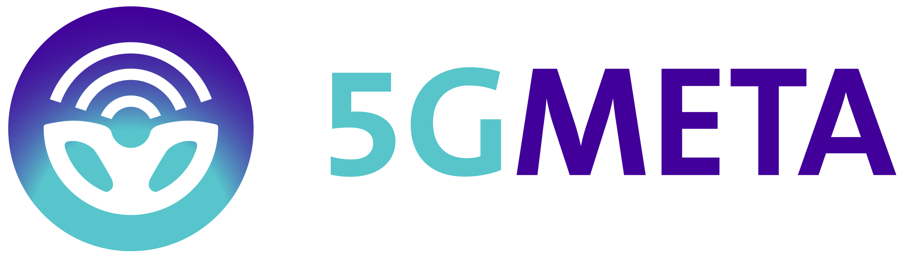

### Hey, this is 5GMETA! 👋

<!--
**5gmeta/5gmeta** is a ✨ _special_ ✨ repository because its `README.md` (this file) appears on your GitHub profile.

Here are some ideas to get you started:

- 🔭 I’m currently working on ...
- 🌱 I’m currently learning ...
- 👯 I’m looking to collaborate on ...
- 🤔 I’m looking for help with ...
- 💬 Ask me about ...
- 📫 How to reach me: ...
- 😄 Pronouns: ...
- ⚡ Fun fact: ...
-->

### 🍿 Introduction to the 5GMETA platform
5GMETA is an open data-centric Internet of Things (IoT) messaging platform for Connected and Automated Mobility (CAM) applications and service providers. The 5GMETA Platform creates a CAM data monetization ecosystem that allows different stakeholders along the data value chain to exploit data in a more effective and profitable way.​

A fundamental principle supported by the 5GMETA Platform is that of achieving a total decoupling between Data Producers and Data Consumers. This means that Data Producers do not need to be directly connected to Data Consumers. The 5GMETA Platform acts as a broker between Data Producers (vehicles or RSUs) and Data consumers (third-party applications or services). However, the 5GMETA Platform is not a simple publish-subscribe broker, and it includes functions for data management, data monetization and cybersecurity as well as providing data access mechanisms. In contrast with a Data Lake, the 5GMETA Platform provides live data delivery. The users of the 5GMETA Platform receive the data from the subscribed dataflows in a continuous manner with no storage service within the 5GMETA Platform rather than the required memory buffering. 

These two videos are a good starting point to learn more about the motivation and the basic concepts of the 5GMETA Platform:
* Video 1: [The 5GMETA Project](https://youtu.be/keB3PlQNiec?si=Cq94v0SMFuGyYSBp)
* Video 2: [The 5GMETA Platform](https://youtu.be/RGVD8D0ZwQc?si=t2R2ufpkzkGtogDm)

The Road to Lisbon hackathon webinars are also a great resource:
* [Road to Lisbon_5GMETA Hackathon Webinar #1_Introduction to the Platform](https://youtu.be/-ph7cs_wQa0?si=o6LmF-CHhLxCayTw)
* [Road to Lisbon 5GMETA Hackathon Webinar #2 How to interface with the platform](https://youtu.be/5iSsRsp_II4?si=QglJpST5SNm0loHj)
* [Road to Lisbon 5GMETA Hackathon Webinar #3 Choosing and using available data](https://youtu.be/6Z026lECwlQ?si=WlPHvQyRh5YDnDnO)

More info can also be found on the [5GMETA website](https://5gmeta-project.eu/).

### ⚡ 5GMETA platform components
<!-- table with components, link and one sentence describing component -->

### :raising_hand: Contributing to the platform

Contributions are welcome :blush: See [how to contribute](./CONTRIBUTING.md).

📫 If you want to reach us, send us an e-mail to 5gmeta-github@vicomtech.org
